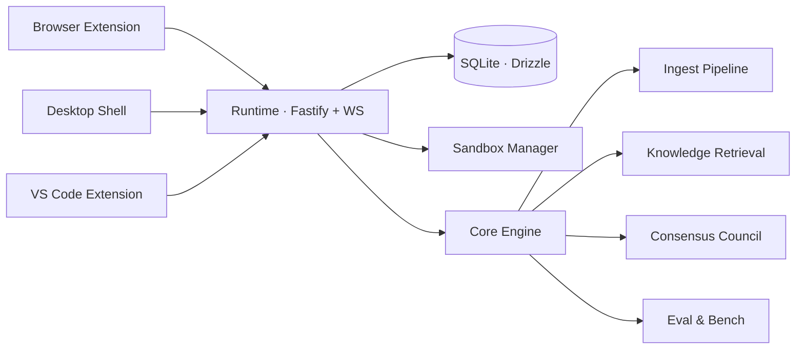

<div align="center">

# VeggaAI

### Virtual Apprentice Intelligence — a local-first thinking interface for builders

VeggaAI (**VAI**) is your own AI engine: a local-first apprentice that helps you **think clearly, build software, and iterate with evidence** instead of vague automation theater. It is not another answer-generator — it is the deterministic layer that makes answer-generators usable, testable, and harder to misuse.

[](https://www.typescriptlang.org/)
[](https://nodejs.org/)
[](https://tauri.app/)
[](https://www.sqlite.org/)
[](LICENSE)


</div>

---

## Why VAI exists

Most AI tools are **oracles**: you ask, they answer. They optimize for breadth of information, never push back on a weak question, and reset their memory of you every session.

VAI is built for the opposite job — **depth of reasoning over breadth of facts**. It sits between you and the models you already use (Claude, GPT, Cursor) as a deterministic thinking interface that:

- **shows its work** — every turn surfaces *how* it read your message, *what* it grounded the answer in, and *why* it chose its approach;
- **refuses honestly** — when it has no grounded answer it says so, instead of confidently bullshitting;
- **remembers your patterns** — an append-only memory store compounds across sessions without retraining anything;
- **grounds answers in real sources** — captured pages, docs, and your own knowledge base, with citations you can inspect.

> **The thesis, in one line:**
> VAI is not a better answer-generator. It is the deterministic thinking interface that makes answer-generators usable, testable, and harder to misuse.

See [`docs/the-idea.md`](docs/the-idea.md) and [`Master.md`](Master.md) for the full product doctrine.

---

## What it does

| Capability | What you get |
| --- | --- |
| 🧠 **Transparent reasoning** | A live "process" panel — Read → Route → Evidence → Compose → Verify — with per-step timing, the chosen strategy, and a misroute detector. No black-box turns. |
| 📚 **Browsing memory** | A browser extension captures what you read (3 context levels) with per-domain privacy policy, then answers *"where did I read this, and why does it matter?"* |
| 🛠️ **Build with live preview** | Chat your way to a running app in a sandbox, with a propose → apply → test → iterate loop and a visible build status. |
| 🗂️ **A real workspace sidebar** | Resizable / collapsible rail, pinned & dated chat groups, drag-to-reorder, right-click rename/archive/delete, live "Working…" status, and a fully themeable shell. |
| ⏳ **Steer & Queue** | While a turn is streaming, inject live guidance (**Steer**) or queue a follow-up that auto-sends when the turn finishes. |
| 🔌 **Pluggable models** | A built-in VAI engine plus optional adapters (local Ollama, hosted models). Start with what you have; fine-tune later. |
| 🧩 **VS Code companion** | Dev logs, broadcast workflows, audit fan-out, and sandbox handoff from inside your editor. |
| 📈 **Quality flywheel** | A golden retrieval corpus + CI regression gate so retrieval quality is *measured*, not asserted. |

---

## Core surfaces

```
apps/desktop            Tauri + React desktop shell (also runs as web)
apps/extension          WXT browser extension — browsing-memory capture
apps/vscode-extension   VS Code companion — dev logs, broadcast, sandbox handoff
apps/vcus               VCUS benchmark harness
packages/core           VAI engine, ingest, retrieval, consensus council, eval, sessions, skills
packages/runtime        Fastify + WebSocket runtime, SQLite (Drizzle), sandbox manager
packages/api-types      Shared API contracts and Zod schemas
packages/ui             Shared UI primitives
```

---

## Quickstart

> **Prerequisites:** Node 22+, [pnpm](https://pnpm.io/). Windows-first, but the stack is cross-platform.

```bash
# 1. Install dependencies
pnpm install

# 2. Start the runtime + desktop shell
pnpm dev
#    → runtime on http://localhost:3006
#    → desktop shell in Vite dev mode

# 3. Start the browser extension (separate terminal)
pnpm dev:ext
```

### Try the memory loop

1. Open the browser extension on a real page and **capture** it.
2. Switch to the desktop shell.
3. Ask what you read — and why it matters. VAI answers from your captured memory, with sources.

---

## Architecture



The runtime is the single hub: every surface (browser, desktop, editor) talks to it over HTTP + WebSocket. The core engine owns ingestion, retrieval, the consensus council that grades answer quality, and the eval harness. State is local SQLite — **nothing leaves your machine unless you wire an external model.**

---

## Privacy & trust

Browser capture is explicit by design:

- sensitive pages default to **`never`**;
- each domain can be set to **`always` / `ask` / `never`**;
- captured content is **sanitized before ingestion**;
- capture actions are **logged locally** in the extension popup;
- grounded answers **surface their source evidence** in the desktop UI.

---

## Quality flywheel

VAI treats retrieval quality as a measured property, not a claim:

- **golden corpus:** `eval/retrieval/memory-golden.json`
- **evaluator:** `packages/core/src/eval/retrieval-flywheel.ts`
- **run it:** `pnpm vai:retrieval:eval`
- **CI gate:** `.github/workflows/ci.yml`

Tracked signals: retrieval recall@k, top-1 accuracy, grounded-answer pass rate, and a citation-precision signal.

---

## Useful commands

```bash
pnpm lint                 # lint the monorepo
pnpm typecheck            # typecheck all packages
pnpm test                 # run the test suites
pnpm vai:retrieval:eval   # browsing-memory retrieval regression
pnpm vai:chat:bench       # chat-quality benchmark
pnpm vai:eval             # full eval pass
pnpm dev:web              # desktop shell as a web app
pnpm dev:desktop          # desktop shell (Tauri)
pnpm dev:ext              # browser extension
pnpm app:update           # rebuild + update the installed desktop binary
```

---

## Product doctrine

The durable source of truth lives in **[`Master.md`](Master.md)** — authority and scope, product doctrine, performance and trust priorities, and quality floors. Everything else in the repo is subordinate to it.

Start reading here:

- [`docs/the-idea.md`](docs/the-idea.md) — what VAI is, and deliberately is **not**
- [`docs/INDEX.md`](docs/INDEX.md) — the docs map
- [`Master.md`](Master.md) — the constitution
- [`docs/TESTING-STRATEGY.md`](docs/TESTING-STRATEGY.md) — how quality is enforced

---

## Status

VAI is an active monorepo with a local runtime, a desktop shell, a browser capture loop, source-backed chat surfaces, and eval + benchmark infrastructure. It evolves quickly, with a deliberate bias toward **measurable retrieval quality, visible trust controls, and end-to-end working slices over breadth.**

## Contributing

See [`CONTRIBUTING.md`](CONTRIBUTING.md) and [`SECURITY.md`](SECURITY.md).

## License

[MIT](LICENSE) © 2026 Vegga Thorsen
