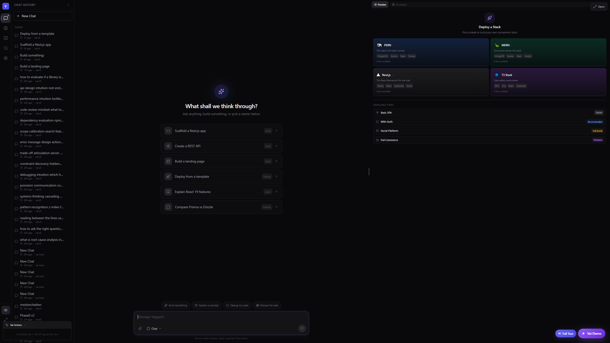
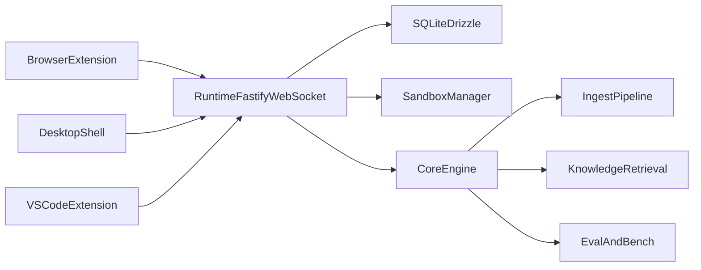

# VeggaAI

VeggaAI, or **VAI** (**Virtual Apprentice Intelligence**), is a local-first AI apprentice built to help you think, retrieve what you read earlier, build software, and iterate with real evidence instead of vague automation theater.

The current north star is simple:

> turn VAI into the best possible "I read this before - find it, explain it, and show me why" machine.



## What it does

- Runs a local-first runtime with a built-in VAI engine and optional external model adapters.
- Captures browsing knowledge through a browser extension with privacy controls and per-domain capture policy.
- Ships a desktop shell for chat, live build/preview, session logs, source-backed answers, and diagnostics.
- Includes a VS Code extension for dev logs, broadcast workflows, audit fanout, and sandbox handoff.
- Tracks retrieval quality with a golden browsing-memory eval corpus and CI regression gate.
- Keeps prompt engineering, evals, sessions, and skills in the same monorepo.

## Core surfaces

- `apps/desktop` — Tauri + React desktop shell
- `apps/extension` — WXT browser extension
- `apps/vscode-extension` — VS Code companion extension
- `packages/core` — VAI engine, ingest, search, eval, sessions, skills
- `packages/runtime` — Fastify + WebSocket runtime
- `packages/api-types` — shared API contracts and schemas
- `packages/ui` — shared UI primitives

## Quickstart

### 1. Install dependencies

```bash
pnpm install
```

### 2. Start the runtime + desktop shell

```bash
pnpm dev
```

This starts:

- the runtime on `http://localhost:3006`
- the desktop shell in Vite dev mode

### 3. Start the browser extension separately

```bash
pnpm dev:ext
```

### 4. Try the memory loop

1. Open the browser extension on a real page and capture it.
2. Go back to the desktop shell.
3. Ask what you read and why it matters.

## Useful commands

```bash
pnpm lint
pnpm typecheck
pnpm test
pnpm vai:retrieval:eval
pnpm vai:chat:bench
pnpm vai:eval
pnpm dev:web
pnpm dev:desktop
pnpm dev:ext
```

## Architecture



## Retrieval quality flywheel

VAI now includes a dedicated browsing-memory regression loop:

- golden corpus: `eval/retrieval/memory-golden.json`
- reusable evaluator: `packages/core/src/eval/retrieval-flywheel.ts`
- script: `pnpm vai:retrieval:eval`
- CI gate: `.github/workflows/ci.yml`

The goal is to measure:

- retrieval recall@k
- top-1 retrieval accuracy
- grounded answer pass rate
- citation precision signal

## Privacy and trust

The browser capture flow is designed to be explicit:

- sensitive pages default to `never`
- each domain can be set to `always`, `ask`, or `never`
- capture content is sanitized before ingestion
- capture actions are logged locally in the extension popup
- grounded answers surface their source evidence in the desktop UI

## Product doctrine

The durable source of truth for the project lives in [`Master.md`](Master.md).

That file defines:

- authority and scope
- product doctrine
- performance and trust priorities
- quality floors

Everything else in the repo is subordinate to it.

## Docs

Start here:

- [`docs/INDEX.md`](docs/INDEX.md)
- [`Master.md`](Master.md)
- [`docs/TESTING-STRATEGY.md`](docs/TESTING-STRATEGY.md)

## Current status

VAI is an active monorepo with:

- a local runtime
- a desktop shell
- a browser capture loop
- source-backed chat surfaces
- eval and benchmark infrastructure

It is still evolving quickly, with a strong bias toward measurable retrieval quality, visible trust controls, and end-to-end working slices over breadth.

## Contributing

See [`CONTRIBUTING.md`](CONTRIBUTING.md).

## License

See [`LICENSE`](LICENSE).
